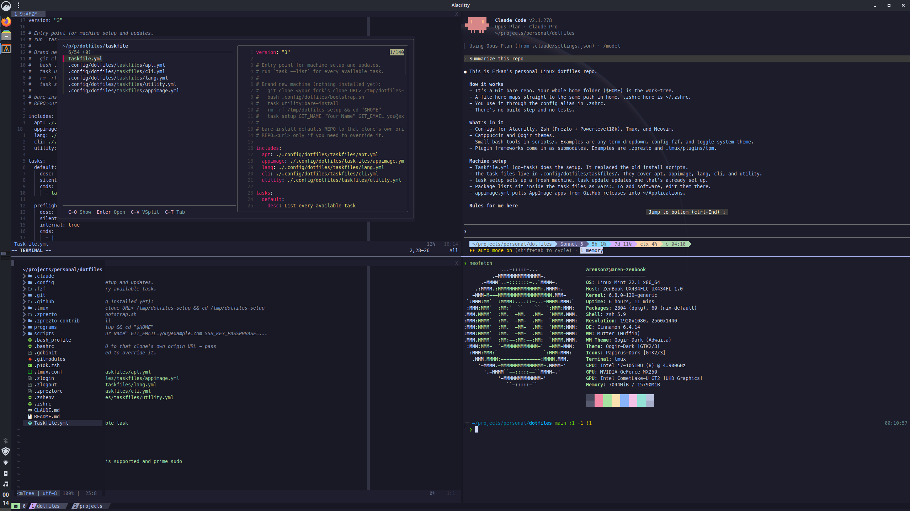

# Dotfiles

My Linux setup in one Git repo: shell, terminal, editor, themes, and a [go-task](https://taskfile.dev) Taskfile that
builds a fresh machine from zero.

The repo is a Git [bare repository](https://www.atlassian.com/git/tutorials/dotfiles) whose work-tree is `$HOME`. Files
live at their real paths (`.zshrc` is `~/.zshrc`). No symlinks, no stow.



- [What's inside](#whats-inside)
- [Install](#install)
- [Daily use](#daily-use)
- [Tasks](#tasks)
- [Scripts](#scripts)

## What's inside

| Program | Setup |
| --- | --- |
| **Zsh** | [Prezto](https://github.com/sorin-ionescu/prezto) + [Powerlevel10k](https://github.com/romkatv/powerlevel10k), plus `zsh-z`, `zsh-you-should-use`, `zsh-bat`, `fzf-tab` |
| **Alacritty** | Catppuccin (Mocha, Latte) |
| **Tmux** | [TPM](https://github.com/tmux-plugins/tpm) with Catppuccin (Mocha), `tmux-sensible`, `tmux-resurrect` and `tmux-yank` |
| **Neovim** | [vim-plug](https://github.com/junegunn/vim-plug) with Catppuccin (Mocha, Latte), coc.nvim, ALE, fzf, and more goodies |

Themes:
- [Catppuccin](https://catppuccin.com/) color theme for Alacritty, Tmux and Neovim
- [Qogir](https://github.com/vinceliuice/Qogir-theme) GTK theme and
   [Papirus](https://github.com/PapirusDevelopmentTeam/papirus-icon-theme) icons, dark/light mode
   switch by `toggle-system-theme` script

Third-party plugin frameworks are Git submodules, not copies.

## Install

> [!NOTE]
> Ubuntu and Ubuntu-based distros only.

1. Fork the repo. Copy your fork's clone URL.

2. Clone it to a throwaway folder and install `task`.

   ```sh
   git clone <your-fork-clone-url> /tmp/dotfiles-setup
   cd /tmp/dotfiles-setup
   bash .config/dotfiles/bootstrap.sh
   export PATH="$HOME/.local/bin:$PATH"   # if `task` isn't found yet
   ```

3. Turn `$HOME` into the checkout.

   ```sh
   task utility:bare-install
   ```

   If files in `$HOME` would be overwritten, it asks first. Say yes and they move to `~/.dotfiles-backup/<timestamp>/`.

4. Set up the machine.

   ```sh
   cd "$HOME"
   rm -rf /tmp/dotfiles-setup
   task setup GIT_NAME="Your Name" GIT_EMAIL=you@example.com SSH_KEY_PASSPHRASE=...
   ```

   Put a space before `task setup` so the passphrase stays out of your shell history.

`setup` installs apt packages, language runtimes (nvm/node, pyenv/python, pipx, go), an SSH key, Git identity and
signing, shell plugins, fonts, fzf, npm/pipx/cargo apps, and AppImages. It prints your new public key at the end. Add it
to GitHub as both an authentication key and a signing key.

> [!TIP]
> Log out and back in after `setup`, then run `task doctor` to check everything.

## Daily use

Use the `config` alias in place of `git`:

```sh
config status
config add ~/.zshrc
config commit -m "Modify zsh config"
config push origin main
```

`config status` only lists tracked files. Untracked files are hidden, or it would list all of `$HOME`. So a new file
won't show up until you `config add` it.

- **`config-edit`** opens your editor with the right Git env vars, so plugins like `vim-fugitive` see the dotfiles repo.
- **`config-fzf`** is an fzf picker over tracked files:

  ```sh
  nvim -O $(config-fzf)
  ```

## Tasks

Run `task --list` for the full list. The main ones:

| Task | What it does |
| --- | --- |
| `task setup` | Fresh machine. Everything in `update`, plus one-time installs |
| `task update` | Update submodules, apt, runtimes, CLI tools, and AppImages |
| `task self-update` | Update `task` itself |
| `task doctor` | Show tool versions. Exit non-zero if anything is missing |

Namespaces: `apt`, `lang`, `cli`, `appimage`, `utility`. Package lists are plain `vars:` at the top of each taskfile in
`.config/dotfiles/taskfiles/`. Add software there, not in the task logic.

> [!WARNING]
> Tasks change a running system. Read a task before you run it.

AppImage-only apps are listed in `appimage.yml` and pulled from GitHub releases into `~/Applications`, where
[AppImageLauncher](https://github.com/TheAssassin/AppImageLauncher) adds menu entries.

## Scripts

Standalone bash tools in `scripts/`. Run them directly or bind them to a shortcut.

| Script | Purpose |
| --- | --- |
| `any-term-dropdown` | Drop-down terminal toggle |
| `appimage-get` | Fetch the newest AppImage from a GitHub repo |
| `config-fzf` | fzf picker over dotfiles-tracked files |
| `config-sync` | Mirror a checkout into `$HOME` to test edits live |
| `print-term-colors` | Print the terminal color palette |
| `setup-ip-forwarding` | Set up IP forwarding |
| `sub-to-utf8` | Convert subtitle files to UTF-8 |
| `task-note` | Print a highlighted note from tasks |
| `toggle-system-theme` | Flip Qogir/Papirus between dark and light |
